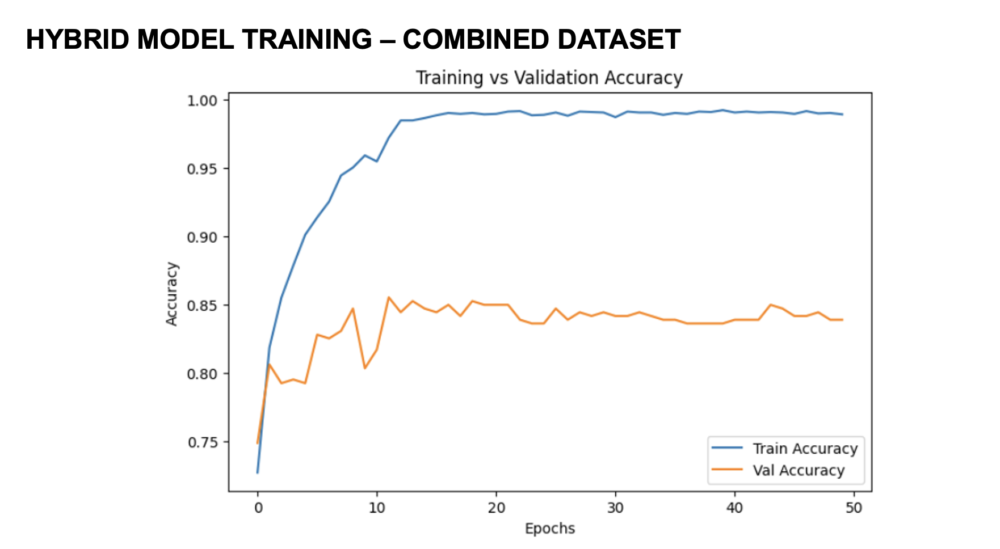
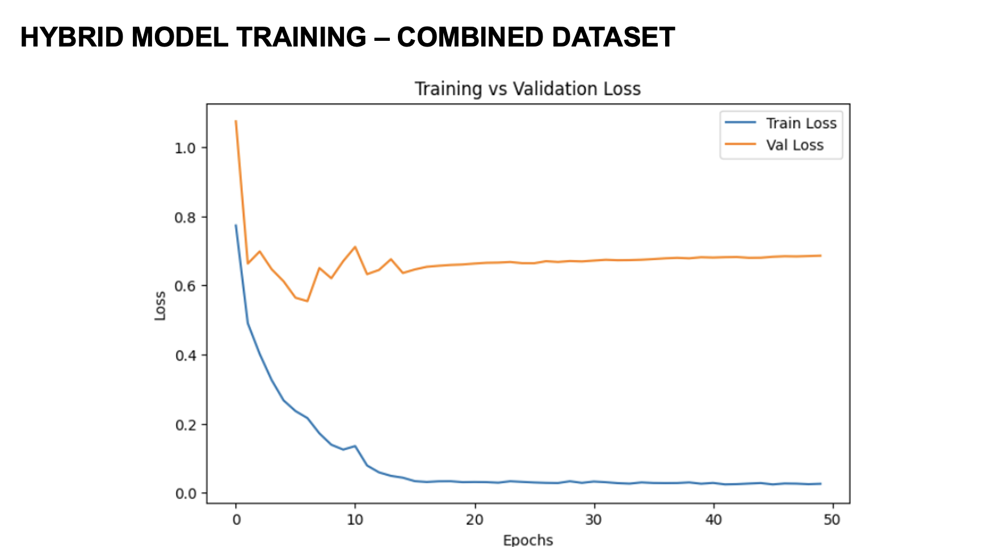
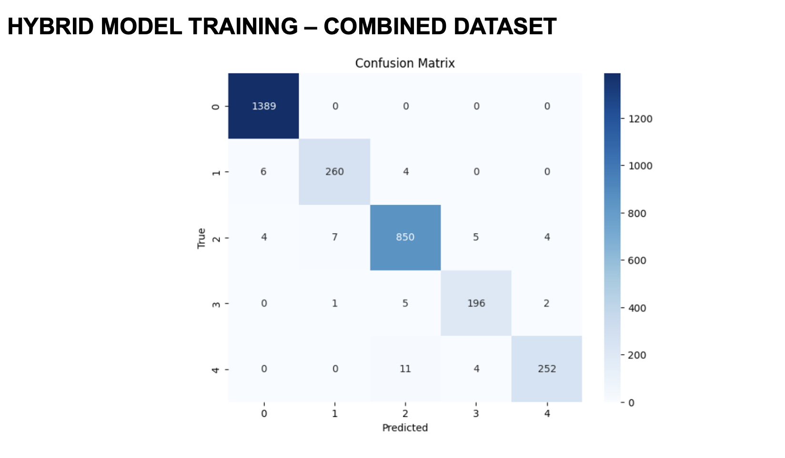

# 🔬 Diabetic Retinopathy Detection — Hybrid DenseNet121 + Transformer

  

A deep learning system for automated **5-class diabetic retinopathy severity classification** using a hybrid architecture combining **DenseNet121** (CNN) with **Multi-Head Self-Attention** (Transformer), trained on a custom combined dataset of **15,000+ retinal fundus images**.

---

## 🏆 Results

| Metric | Score |
|--------|-------|
| **Training Accuracy** | 98.83% |
| **Validation Accuracy** | 85.52% (best) |
| **Weighted F1-Score** | 0.83 |
| **Macro Avg Precision** | 0.74 |

### Classification Report

| Class | Precision | Recall | F1-Score |
|-------|-----------|--------|----------|
| 0 — No DR | 0.97 | 0.99 | 0.98 |
| 1 — Mild | 0.70 | 0.65 | 0.68 |
| 2 — Moderate | 0.74 | 0.84 | 0.79 |
| 3 — Severe | 0.64 | 0.32 | 0.42 |
| 4 — Proliferative DR | 0.64 | 0.57 | 0.60 |

### Training Curves & Confusion Matrix

| Accuracy | Loss |
|----------|------|
|  |  |



---

## 🧠 Model Architecture

```
Input (224x224x3)
    ↓
DenseNet121 (ImageNet pretrained, frozen backbone)
    ↓
GlobalAveragePooling2D
    ↓
Dense(512, ReLU)
    ↓
Reshape → Multi-Head Attention (8 heads, key_dim=64)  ← Transformer Block
    ↓
Add & LayerNorm (Residual Connection)
    ↓
Dense(5, Softmax)  → 5-class output
```

The key idea: **DenseNet121 extracts rich spatial features** from retinal images, while the **Transformer attention mechanism** enables the model to focus on the most diagnostically relevant regions.

---

## 📦 Dataset

We combined and augmented three data sources to build a robust, balanced dataset of **15,000+ images**:

| Source | Description |
|--------|-------------|
| [APTOS 2019](https://www.kaggle.com/c/aptos2019-blindness-detection) | Kaggle Blindness Detection Challenge |
| [Messidor](https://www.adcis.net/en/third-party/messidor/) | French diabetic retinopathy dataset |
| **Custom Augmented** | Medical-grade augmentation applied to balance classes |

### Medical Augmentation Techniques Applied
- Rotation (±15°)
- Horizontal flipping
- Brightness adjustment (0.8x – 1.2x)
- (Additional domain-specific transforms for class balancing)

> ⚠️ Dataset not included in this repo due to size. Download APTOS 2019 and Messidor from the links above.

---

## 🚀 How to Run

### 1. Clone the repo
```bash
git clone https://github.com/KingmakerKou/diabetic-retinopathy-hybrid-cnn-transformer.git
cd diabetic-retinopathy-hybrid-cnn-transformer
```

### 2. Install dependencies
```bash
pip install -r requirements.txt
```

### 3. Run on Kaggle (Recommended)
This code is optimized to run on **Kaggle Notebooks** with GPU acceleration.
- Upload `diabetic_retinopathy.py` to a Kaggle notebook
- Add the APTOS 2019 dataset from Kaggle
- Run all cells

---

## 🛠️ Tech Stack

- **Deep Learning:** TensorFlow / Keras
- **CNN Backbone:** DenseNet121 (pretrained on ImageNet)
- **Attention:** Multi-Head Self-Attention (Transformer block)
- **Data:** Pandas, NumPy, ImageDataGenerator
- **Evaluation:** Scikit-learn (confusion matrix, classification report)
- **Visualization:** Matplotlib, Seaborn

---

## 📁 Project Structure

```
diabetic-retinopathy-hybrid-cnn-transformer/
├── diabetic_retinopathy.py   # Main model code
├── requirements.txt          # Dependencies
├── results/                  # Training plots & confusion matrix
│   ├── accuracy.png
│   ├── loss.png
│   └── confusion_matrix.png
└── README.md
```

---

## 👥 Team

Built as a final year B.Tech project at **PSG College of Technology, Coimbatore**

---

## 📄 License

This project is licensed under the MIT License.
